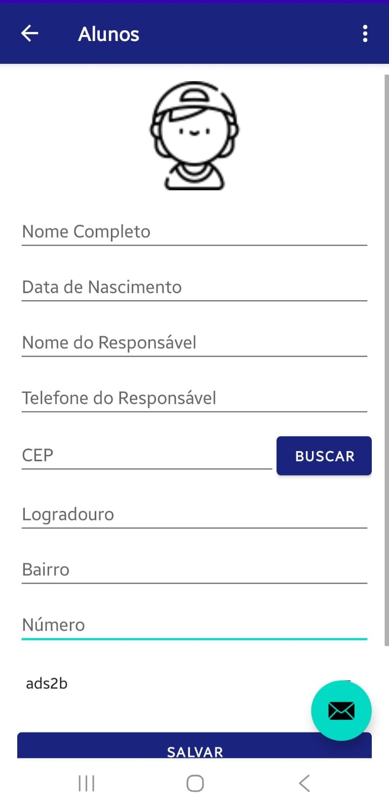

# App de Gerenciamento de Transporte Escolar 🚐

Este é um aplicativo Android desenvolvido para simplificar o gerenciamento de informações no contexto de transporte escolar. Ele oferece uma plataforma centralizada para cadastrar e organizar dados essenciais de Alunos, Responsáveis, Tripulantes, Escolas e Turmas.

## ✨ Funcionalidades Principais

* **Autenticação de Usuários**: Sistema de login e registro para garantir o acesso seguro à aplicação.
* **Gerenciamento Completo (CRUD)**: Interface completa para Criar, Ler, Atualizar e Deletar registros das seguintes entidades:
  * Alunos
  * Responsáveis
  * Tripulantes (Motoristas, Monitores, etc.)
  * Escolas
  * Turmas
* **Busca de Endereço por CEP**: Integração com a API **ViaCEP** para preenchimento automático dos campos de endereço (Logradouro e Bairro) durante o cadastro, agilizando o processo e reduzindo erros de digitação.
* **Interface Intuitiva**:
  * Navegação principal através de um menu de ícones claros e objetivos.
  * Uso de componentes modernos do Material Design para uma experiência de usuário limpa.
  * Layouts responsivos que se adaptam a diferentes tamanhos de tela.

## 🚀 Tecnologias e Arquitetura

O projeto foi construído seguindo as melhores práticas de desenvolvimento Android moderno:

* **Linguagem**: 100% [Kotlin](https://kotlinlang.org/)
* **Arquitetura**: MVVM (Model-View-ViewModel), promovendo a separação de responsabilidades e facilitando a manutenção e testabilidade do código.
* **Componentes de Arquitetura Android (Jetpack)**:
  * **Room**: Para um banco de dados local robusto e de fácil acesso.
  * **LiveData & Flow**: Para a criação de fluxos de dados observáveis e reativos entre o banco de dados e a UI.
  * **ViewModel**: Para gerenciar os dados da UI de forma consciente ao ciclo de vida.
  * **Navigation Component**: Para gerenciar toda a navegação entre as telas do aplicativo.
* **Comunicação com API**:
  * **Retrofit**: Para realizar as chamadas de rede à API ViaCEP de forma declarativa e segura.
  * **Gson**: Para converter automaticamente as respostas JSON da API em objetos Kotlin.
* **Interface Gráfica (UI)**:
  * **XML Layouts** com `ConstraintLayout` e `LinearLayout`.
  * **Material Design Components** para botões, campos de texto e outros elementos visuais.
  * **RecyclerView** para a exibição eficiente de listas.

---

## 🛠️ Como Rodar o Projeto

Siga os passos abaixo para clonar e executar o aplicativo em seu ambiente de desenvolvimento local.

### Pré-requisitos
* **Android Studio** (versão Ladybug ou superior recomendada).
* **JDK 17** (geralmente embutido no Android Studio).
* **Git** instalado.

### Passo a Passo

1.  **Clone o repositório**
    Abra o terminal (ou Git Bash) e execute o seguinte comando na pasta de sua preferência:
    ```bash
    git clone [https://github.com/AlexJrDev96/TransporteAPP.git](https://github.com/AlexJrDev96/TransporteAPP.git)
    ```

2.  **Abra o projeto no Android Studio**
  * Inicie o Android Studio.
  * Clique em **File > Open** (ou "Open").
  * Navegue até a pasta onde você clonou o projeto (`TransporteAPP`) e clique em **OK**.

3.  **Sincronização do Gradle**
  * O Android Studio detectará automaticamente os arquivos `build.gradle.kts`.
  * Aguarde o processo de **Gradle Sync** finalizar (pode demorar alguns minutos na primeira vez enquanto baixa as dependências).

4.  **Configurar Dispositivo Virtual (Emulador)**
  * Vá em **Tools > Device Manager**.
  * Crie um dispositivo virtual (ex: Pixel 6 API 34) ou conecte seu celular físico via USB (com Depuração USB ativada).

5.  **Executar o App**
  * Certifique-se de que o módulo `app` está selecionado na barra superior.
  * Clique no botão **Run** (o triângulo verde ▶️) ou pressione `Shift + F10`.

> **Nota:** Para testar a funcionalidade de CEP, certifique-se de que o emulador ou dispositivo possui conexão ativa com a internet.

---

## 📱 Telas do Aplicativo

*(prints das telas principais do app)*

|           Login           | Menu Principal |        Cadastro de Aluno         |
|:-------------------------:|:---:|:--------------------------------:|
|  |  |  |

---

## 👨‍💻 Autores

- **Alex Manoel** — RA: 1701381
- **Ana Laura** — RA: 2402680
- **Gustavo Bomfim** — RA: 2403139

---